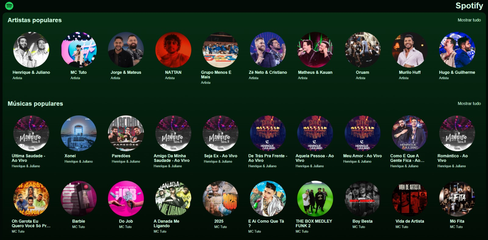
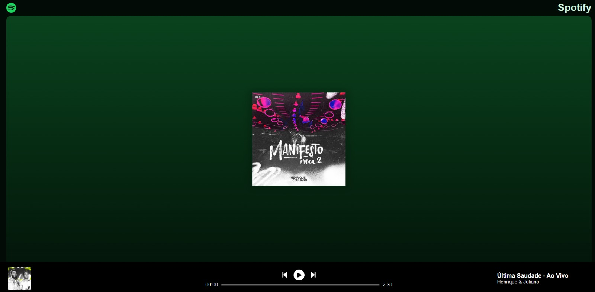
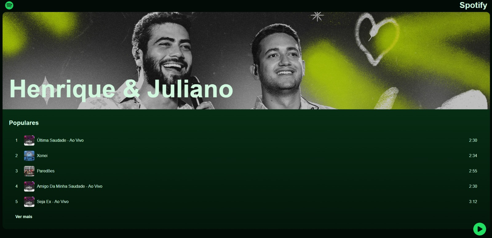

🎵 Spotify Clone

Este projeto é uma réplica do Spotify, desenvolvido com um front-end bem estruturado e um back-end eficiente rodando em um banco de dados MongoDB. O destaque principal é a tela de player, que permite a reprodução de músicas, proporcionando uma experiência prática e dinâmica semelhante ao aplicativo original.

🚀 Tecnologias Utilizadas

🔹 Front-end:

React.js - Para construção da interface dinâmica e interativa.

Styled Components / Tailwind CSS - Para estilização moderna e responsiva.

🔹 Back-end:

Node.js - Para construção da API.

Express.js - Para gerenciamento de rotas e requisições.

MongoDB + Mongoose - Para armazenamento de dados.

📌 Funcionalidades

✅ Catálogo de Músicas - Listagem de músicas disponíveis no banco de dados.✅ Reprodução de Áudio - Player integrado para tocar músicas.✅ Modo Responsivo - Layout adaptável para diferentes dispositivos.

🛠 Como Rodar o Projeto

🔹 Clone o Repositório:

git clone https://github.com/DaviSilvaAguiar/spotify-fullstack
cd seu-repositorio

🔹 Configuração do Back-end:

Instale as dependências:

cd backend
npm install

Crie um arquivo .env e configure as variáveis de ambiente:

MONGO_URI= sua_string_de_conexao
JWT_SECRET= sua_chave_secreta
AWS_S3_BUCKET= seu_bucket_s3

Inicie o servidor:

npm run dev

🔹 Configuração do Front-end:

Instale as dependências:

cd frontend
npm install

Inicie o projeto:

npm start

📷 Demonstração

📜 Licença

Este projeto está sob a licença MIT. Sinta-se livre para usá-lo e modificá-lo.

📞 Contato

📧 Email: daviagui13@gmail.com💻 GitHub: DaviSilvaAguiar🔗 LinkedIn: https://www.linkedin.com/in/davi-aguiar-b4b738280/

🎵 Spotify Clone
This project is a replica of Spotify, developed with a well-structured front-end and an efficient back-end running on a MongoDB database. The main highlight is the player screen, which allows music playback, providing a practical and dynamic experience similar to the original app.

🚀 Technologies Used
For the front-end, the project uses React.js for building a dynamic and interactive interface, along with Styled Components and Tailwind CSS for modern and responsive styling. On the back-end, it is developed with Node.js for API construction, Express.js for route and request management, and MongoDB with Mongoose for data storage.

📌 Features
The project includes several features, such as a music catalog that lists available songs from the database, an integrated player for audio playback, and a responsive design that adapts to different devices.

🛠 How to Run the Project
To run the project, first, clone the repository using the command git clone https://github.com/DaviSilvaAguiar/spotify-fullstack and navigate to the corresponding folder. In the back-end, install the dependencies with npm install, create a .env file, and configure the environment variables, including MONGO_URI, JWT_SECRET, and AWS_S3_BUCKET. Then, start the server with npm run dev. For the front-end, go to the project folder, install the dependencies with npm install, and run the project using npm start.

📷 Demo

📜 License
This project is licensed under the MIT license, allowing free use and modification.

📞 Contact
For more information, contact me via email at daviagui13@gmail.com. You can also check out the project on GitHub at DaviSilvaAguiar or connect on LinkedIn at Davi Aguiar.
